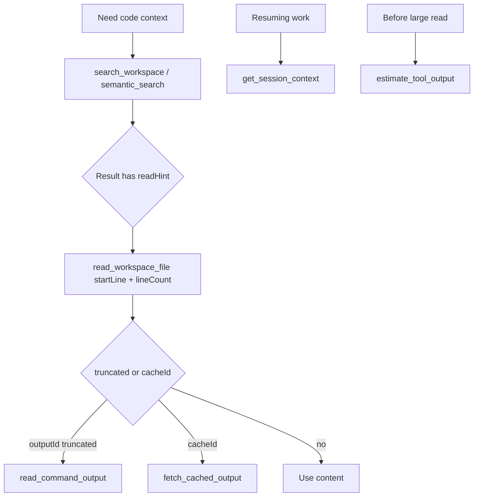

# Context Compression (local-coding-tools-mcp)

Các tool MCP nén lượng dữ liệu trả về model mỗi lần gọi, theo cùng nguyên tắc mà Cursor dùng cho Composer (đặc biệt Composer 2.5 Fast): trả ít token hơn nhưng vẫn đủ thông tin, qua workflow **search → đọc theo dòng → lấy resource khi cần**.

Áp dụng cho cả **VS Code (Copilot)** và **Cursor** — cùng một MCP server stdio, chỉ khác file cấu hình (`.vscode/mcp.json` vs `.cursor/mcp.json`).

## Ranh giới: host vs MCP

| Tầng | Ai làm | Cơ chế |
|------|--------|--------|
| IDE host (VS Code / Cursor) | Không sửa được qua MCP | Tóm tắt hội thoại, chọn model |
| MCP server | Dự án này | Truncate output, đọc theo dòng, cache resource, session bank, token estimate |

MCP chỉ kiểm soát **output từng tool** và **state phiên local** — không thay thế tóm tắt chat của host.

## Map cơ chế Cursor → MCP

| Cơ chế Cursor | Tool/Utility MCP |
|---------------|------------------|
| Tool result truncation | `truncateStructured` (head / head_tail) trong mọi tool exec/network |
| `chunkContents` (đọc theo đoạn) | `read_workspace_file` với `startLine` + `lineCount`; `search_workspace`/`semantic_search` trả `readHint` |
| `textBlobId` (blob indirection) | `outputCache` + MCP Resource `mcp-cache://{id}` + `fetch_cached_output` |
| Context Bank (state phiên) | `contextBank` session + `get_session_context` / `clear_session_context` |
| `PromptTokenBreakdown` | `estimate_tool_output`, `tokenEstimate` |
| `ConversationSummary` | `summarize_tool_history` |
| Command log readback | `read_command_output` (saved stdout/stderr + runtime log tail) |
| context-stripping | `stripContextBlocks` (tùy chọn `stripContext` trong `read_workspace_file`) |

## Workflow khuyến nghị



## Biến môi trường

Đặt trong khối `env` của `.vscode/mcp.json` (VS Code) hoặc `.cursor/mcp.json` (Cursor). Cả hai install script đều đặt sẵn `MCP_MAX_OUTPUT_CHARS=12000` và `MCP_READ_DEFAULT_LINES=60`.

| Env | Mặc định | Install script đặt | Ý nghĩa |
|-----|----------|--------------------|---------|
| `MCP_MAX_OUTPUT_CHARS` | `20000` | `12000` | Ngưỡng cắt output mỗi tool |
| `MCP_READ_DEFAULT_LINES` | `80` | `60` | Số dòng mặc định cho line-range read |
| `MCP_READ_MAX_LINES` | `200` | — | Cap dòng tối đa mỗi read |
| `MCP_CACHE_MAX_BYTES` | `524288` | — | Ngưỡng chuyển output sang cache resource |
| `MCP_CACHE_TTL_MS` | `3600000` | — | TTL cache trong `.mcp-debug/cache/` |

Ví dụ `.vscode/mcp.json`:

```json
{
  "servers": {
    "local-coding-tools": {
      "type": "stdio",
      "command": "node",
      "args": ["<ServerRoot>\\dist\\server.js"],
      "cwd": "<ServerRoot>",
      "env": {
        "MCP_MAX_OUTPUT_CHARS": "12000",
        "MCP_READ_DEFAULT_LINES": "60"
      }
    }
  }
}
```

Giá trị thấp hơn (12K / 60 dòng) phù hợp với model nhanh / context window nhỏ hơn.

## Prompt mẫu cho Composer 2.5 Fast

```
Dùng MCP local-coding-tools theo context budget:
1. search_workspace "<từ khóa>" trước.
2. read_workspace_file với startLine + lineCount theo readHint, không đọc cả file.
3. Nếu kết quả có cacheId, dùng fetch_cached_output thay vì chạy lại.
4. get_session_context khi tiếp tục công việc cũ.
```

## Troubleshooting

| Hiện tượng | Xử lý |
|-----------|-------|
| Output bị cắt (`truncated: true`) | Làm theo `hint`: thu hẹp scope, dùng line range, hoặc `fetch_cached_output` |
| `read_workspace_file` báo `exceeds file length` | Giảm `startLine`, hoặc bỏ line-range để xem `totalLines` |
| Kết quả có `cacheId`/`cacheUri` | Gọi `fetch_cached_output` với `cacheId`, hoặc đọc resource `mcp-cache://{id}` |
| Session lẫn task cũ | `clear_session_context` rồi bắt đầu lại |
